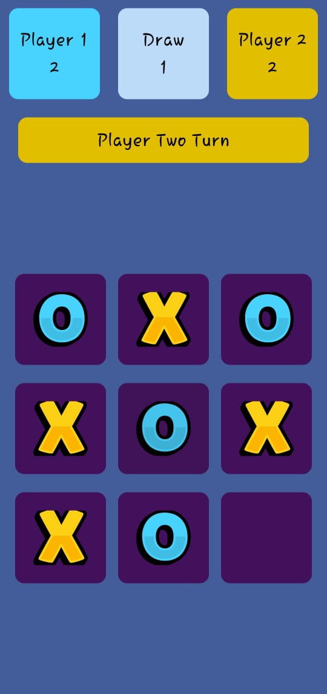

# Tic Tac Toe Game

A simple and interactive Tic Tac Toe game built using **Jetpack Compose**. This project was created as my first step into the world of Compose, leveraging my experience in Flutter app development to explore new possibilities with Kotlin and modern Android UI development.

## Features
- Two-player mode.
- Dynamic game board with clickable cells.
- Real-time score tracking for Player 1, Player 2, and Draws.
- Toast messages to indicate game status (win, draw, invalid move).
- Visually appealing and responsive UI design.

## Technologies Used
- **Kotlin**: Programming language.
- **Jetpack Compose**: Modern UI toolkit for Android.
- **Material 3**: For styling and themes.

## Concepts Utilized
- State management with `remember` and `mutableStateOf`.
- Modular UI components (`Composable` functions like `ScoreCardWidget`, `BoardSquareWidget`, and `GetIcon`).
- Custom shapes and themes (`CustomShapes`, `MaterialTheme.colorScheme`).
- Game logic implementation (`checkGameWon` function).
- Dynamic resource handling with `painterResource` for icons.

## Project Structure
- `MainUi`: Main screen that includes the game board, score display, and turn indication.
- `ScoreCardWidget`: Displays the score for each player and draws.
- `BoardSquareWidget`: Represents each cell in the game board.
- `GetIcon`: Renders the appropriate icon (tic, cross, or empty) for a cell.
- `checkGameWon`: Determines the game status (win, draw, or continue).

## How to Run the Project
1. Clone the repository.
2. Open the project in **Android Studio**.
3. Sync the Gradle files to ensure all dependencies are installed.
4. Run the app on an emulator or a physical Android device.

## Screenshots

## Future Improvements
- Add AI-based single-player mode.
- Include animations for game interactions.
- Optimize game logic for better performance.
- Add a settings screen for customization (e.g., themes, grid size).

## Feedback and Contributions
Feel free to share your feedback or contribute to this project! Contact me on [LinkedIn](https://www.linkedin.com) or create an issue/pull request in the repository.

---

### License
This project is licensed under the MIT License. See the LICENSE file for details.
